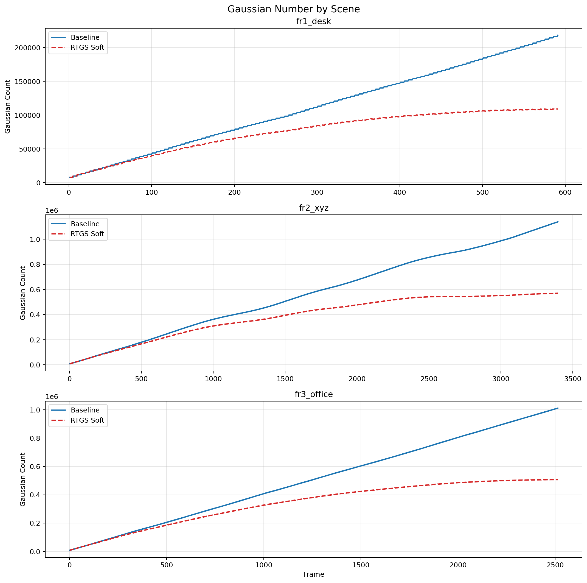

# RTGS: Real-Time 3D Gaussian Splatting SLAM via Multi-Level Redundancy Reduction

[](https://doi.org/10.5281/zenodo.17013198)

A real-time Gaussian Splatting SLAM system built on **MonoGS**, with a **MonoGS Baseline** and an **RTGS Soft** variant (adaptive Gaussian pruning + fast mode).

Repository: [UMN-ZhaoLab/RTGS](https://github.com/UMN-ZhaoLab/RTGS)

---

## Quick Start

### 1. Clone & install

```bash
git clone https://github.com/UMN-ZhaoLab/RTGS.git
cd RTGS

# Create environment (example)
python3 -m venv /path/to/rtgs_venv
source /path/to/rtgs_venv/bin/activate

pip install torch torchvision torchaudio --index-url https://download.pytorch.org/whl/cu121
pip install "numpy<2" opencv-python matplotlib scipy munch trimesh evo==1.11.0 \
  open3d==0.17.0 torchmetrics imgviz PyOpenGL glfw PyGLM lpips rich plyfile \
  tqdm pyyaml wandb psutil wheel ninja

# Build CUDA extensions (required for both Baseline and MonoRTGS)
cd Baseline
pip install --no-build-isolation submodules/simple-knn submodules/diff-gaussian-rasterization
cd ../MonoRTGS
pip install --no-build-isolation submodules/simple-knn submodules/diff-gaussian-rasterization
cd ..

chmod +x run_slam.sh run_full_scenes.sh
```

### 2. Prepare TUM RGB-D datasets

Download the three TUM sequences and place them under `/mnt/hdd/datasets/` (or edit `dataset_path` in the YAML configs):

```bash
mkdir -p /mnt/hdd/datasets
cd /mnt/hdd/datasets

wget -O fr1_desk.tgz https://vision.in.tum.de/rgbd/dataset/freiburg1/rgbd_dataset_freiburg1_desk.tgz && tar -xzf fr1_desk.tgz
wget -O fr2_xyz.tgz  https://vision.in.tum.de/rgbd/dataset/freiburg2/rgbd_dataset_freiburg2_xyz.tgz && tar -xzf fr2_xyz.tgz
wget -O fr3_office.tgz https://vision.in.tum.de/rgbd/dataset/freiburg3/rgbd_dataset_freiburg3_long_office_household.tgz && tar -xzf fr3_office.tgz
```

Default dataset paths in configs:

| Scene | Path |
|-------|------|
| fr1_desk | `/mnt/hdd/datasets/rgbd_dataset_freiburg1_desk` |
| fr2_xyz | `/mnt/hdd/datasets/rgbd_dataset_freiburg2_xyz` |
| fr3_office | `/mnt/hdd/datasets/rgbd_dataset_freiburg3_long_office_household` |

---

## Run a Single Experiment

```bash
source /path/to/rtgs_venv/bin/activate
export CUDA_VISIBLE_DEVICES=0
export PYTHONPATH=$(pwd)

# MonoGS Baseline
./run_slam.sh baseline configs/rgbd/tum/fr1_desk.yaml

# RTGS Soft (adaptive pruning + fast mode)
./run_slam.sh monortgs configs/rgbd/tum/fr1_desk.yaml
```

Results are saved to:

```
Baseline/results/.../slam_results.json
MonoRTGS/results/.../slam_results.json
```

Key fields in `slam_results.json`:

- `average_psnr_db` — PSNR (dB)
- `average_ate_cm` — ATE (cm)
- `average_fps` — wall-clock FPS
- `peak_memory_gb` — peak RSS memory (GB)
- `frame_metrics[].num_gaussians` — per-frame Gaussian count

---

## Run Full Benchmark (Baseline + RTGS Soft, 3 TUM Scenes)

This runs **all three scenes** for both **Baseline** and **RTGS Soft**, then aggregates metrics and generates comparison plots.

```bash
source /path/to/rtgs_venv/bin/activate
export RTGS_VENV=/path/to/rtgs_venv   # used by run_full_scenes.sh
export CUDA_VISIBLE_DEVICES=0
export PYTHONPATH=$(pwd)

# Edit RTGS_VENV in run_full_scenes.sh if needed, then:
bash run_full_scenes.sh
```

What this script does:

1. Runs `fr1_desk`, `fr2_xyz`, `fr3_office` for Baseline and RTGS Soft
2. Saves logs to `comparison_results/full_scenes/`
3. Calls `comparison_results/plot_full_comparison.py` to generate plots and `summary.md`

> **Note:** Full benchmark takes ~1–2 hours on a single GPU (fr2_xyz and fr3_office are long sequences).

---

## Generate Comparison Plots Only

If experiments are already finished and you only need to regenerate plots:

```bash
python3 comparison_results/plot_full_comparison.py
```

Output directory:

```
comparison_results/full_scenes/plots/
├── gaussian_count_comparison.png    # 3 scenes side-by-side
├── gaussian_count_by_scene.png      # 3 scenes stacked (recommended)
├── gaussian_ratio_comparison.png    # RTGS / Baseline ratio over time
```

Summary table:

```
comparison_results/full_scenes/summary.md
```

---

## Example Results (TUM RGB-D, 3-Scene Average)

The table below is reproduced from our benchmark on **fr1_desk**, **fr2_xyz**, and **fr3_office** (RTX A6000, `target_reduction_ratio=0.5`).

| Metric | Baseline | RTGS Soft | Change |
|--------|----------|-----------|--------|
| **PSNR** | 27.26 dB | 27.34 dB | +0.09 |
| **ATE** | 1.59 cm | 1.52 cm | -4.0% |
| **FPS** | 1.86 | 4.98 | **+2.7×** |

Per-scene breakdown:

| Scene | Method | PSNR (dB) | ATE (cm) | FPS |
|-------|--------|-----------|----------|-----|
| fr1_desk | Baseline | 27.25 | 1.61 | 2.43 |
| fr1_desk | RTGS Soft | 27.34 | 1.55 | 7.80 |
| fr2_xyz | Baseline | 27.26 | 1.57 | 1.64 |
| fr2_xyz | RTGS Soft | 27.34 | 1.51 | 3.34 |
| fr3_office | Baseline | 27.26 | 1.57 | 1.52 |
| fr3_office | RTGS Soft | 27.34 | 1.51 | 3.81 |

At sequence end, RTGS Soft keeps approximately **50%** of the Baseline Gaussian count (adaptive pruning target).

### Example: Gaussian Count Curves

Generated by:

```bash
python3 comparison_results/plot_full_comparison.py
```



Blue solid line = MonoGS Baseline; red dashed line = RTGS Soft. RTGS follows a parallel growth trend at roughly half the Baseline Gaussian count.

---

## Project Structure

```
RTGS/
├── run_slam.sh                          # Run baseline or monortgs on one config
├── run_full_scenes.sh                   # Full 3-scene benchmark + plots
├── comparison_results/
│   ├── plot_full_comparison.py          # Aggregate metrics & draw plots
│   └── full_scenes/
│       ├── summary.md                   # Metrics table
│       └── plots/                       # Comparison figures
├── Baseline/                            # MonoGS baseline
│   ├── slam.py
│   ├── configs/rgbd/tum/
│   └── submodules/
└── MonoRTGS/                            # RTGS Soft (pruning + fast mode)
    ├── slam.py
    ├── configs/rgbd/tum/
    └── gaussian_splatting/scene/gaussian_model.py  # adaptive_pruning()
```

### RTGS Soft vs Baseline

| Component | Baseline | RTGS Soft |
|-----------|----------|-----------|
| Entry | `./run_slam.sh baseline ...` | `./run_slam.sh monortgs ...` |
| Pruning | None | `enable_adaptive_pruning: True` |
| Speed | Standard iterations | `enable_fast_mode: True` (4× fewer iters) |
| Config | `Baseline/configs/rgbd/tum/base_config.yaml` | `MonoRTGS/configs/rgbd/tum/base_config.yaml` |

Pruning ratio is set in `MonoRTGS/configs/rgbd/tum/base_config.yaml`:

```yaml
Training:
  enable_adaptive_pruning: True
  target_reduction_ratio: 0.5   # 50% Gaussian reduction by sequence end
  enable_fast_mode: True
```

---

## Docker (optional)

```bash
docker pull mugen0412/monortgs:cuda12.1
docker run --rm -it --gpus all mugen0412/monortgs:cuda12.1 bash
```

---

## Related Projects

- [MonoRTGS (RTX/A100)](https://github.com/Nemo0412/MonoRTGS.git)
- [MonoGS](https://github.com/muskie82/MonoGS.git)
- [GPGPU-Sim](https://github.com/gpgpu-sim/gpgpu-sim_distribution.git)

## Acknowledgements

This project builds upon **MonoGS**, **Photo-SLAM**, and **GPGPU-Sim**. We gratefully acknowledge their open-source contributions.
